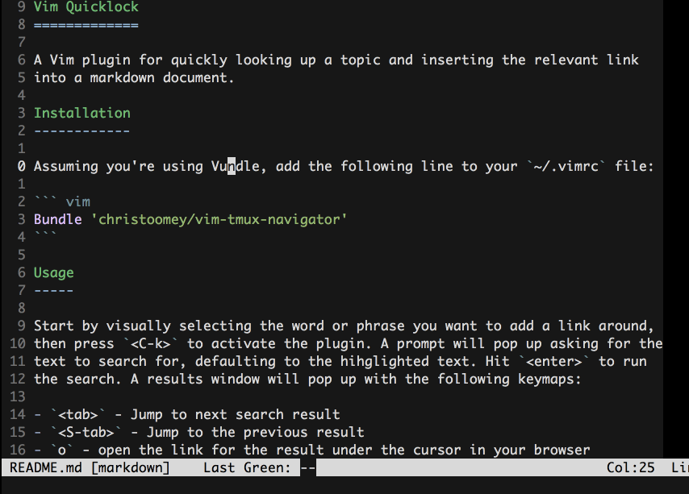

Vim Quicklink
=============

A Vim plugin for quickly looking up a topic and inserting the relevant link
into a markdown document.



Usage
-----

### URL Searching

The main feature of `vim-quicklink` is to search for and insert a relevant link
without needing to leave vim. You can do this by visually selecting the word or
phrase you want to add a link around, then press `<C-k>` to activate the plugin.
A prompt will pop up asking for the text to search for, defaulting to the
highlighted text. Hit `<enter>` to run the search. A results window will pop up
with the following keymaps:

- `<tab>` - Jump to next search result;
- `<S-tab>` - Jump to the previous result;
- `o` - open the link for the result under the cursor in your browser;
- `<enter>` - accept the result under the cursor;
- `q` - quit out of the quicklink adventure.

### Link Opening

`vim-quicklink` also updates the `gx` mapping from `netrw` to work with markdown
link format. The default behavior of `gx` when your cursor is over a URL will
still work and is unchanged, but you can now also use `gx` on a markdown link
such as `[webapi-vim][]` in this readme and `vim-quicklink` will find and open
the associated URL using `netrw`. All keymaps :

- `gx` - Open link under cursor;
- `gl` - Go to link defintion under cursor.

Installation
------------

This plugin relies on a [webapi-vim][], a vimscript wrapper for interacting
with APIs. Assuming you're using Vundle, add the following line to your
`~/.vimrc` file:

``` vim
Bundle 'mattn/webapi-vim'
Bundle 'christoomey/vim-quicklink'
```

[webapi-vim]: https://github.com/mattn/webapi-vim
